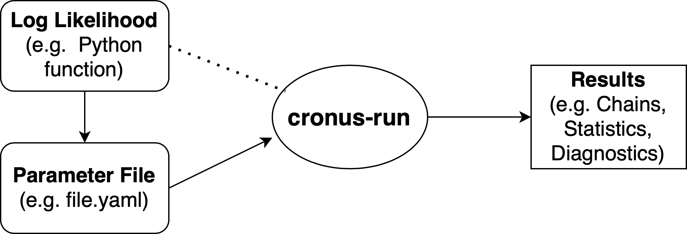
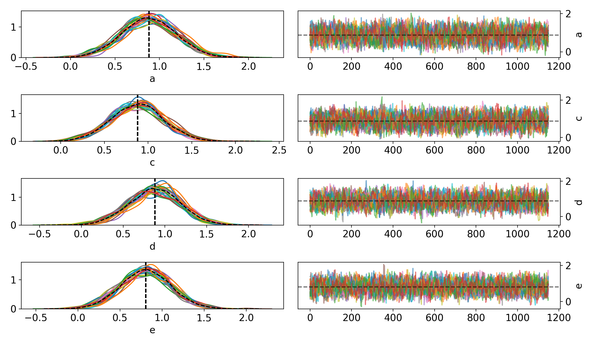
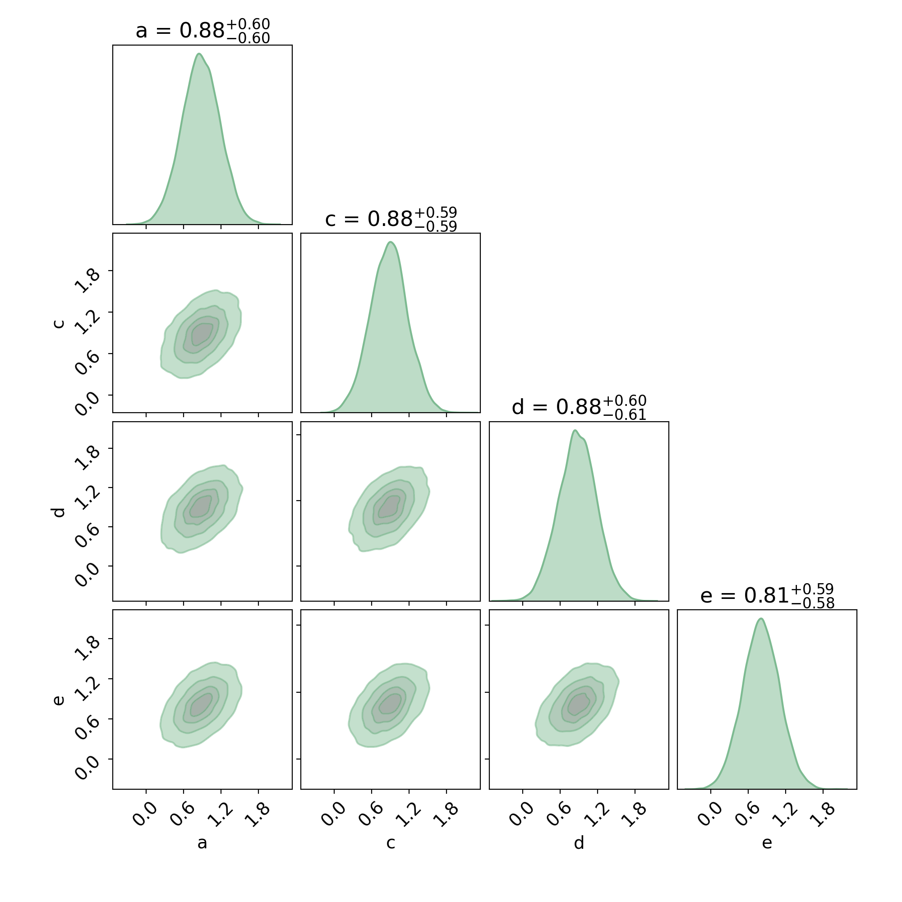

===========
Quick Start
===========

Overview
========

The main purpose of ``cronus`` is to facilitate large-scale Bayesian Inference (e.g. MCMC or NS) in modern
super-computing environments. ``cronus`` utilises ``MPI`` to efficiently distribute the tasks to multiple
nodes. Another important feature of ``cronus`` is its integrated and automated suite of *Convergence Diagnostics*.

Before we go into detail about how to use ``cronus`` let us first discuss the way it works in a higher level.
``cronus`` accepts as an input a parameter file that specifies the following:

- The Python file that contains the definition of the Log Likelihood function,
- A set of priors and/or fixed values for the different parameters of the model that enters the Log Likelihood function.

.. note::
    The Paremeter file can also be used to specify some additional optional information, like:

    - A set of parameters that configure the MCMC/NS sampler (e.g. number of walkers), those are usually trivial to define.
    - A few threshold values for the *Convergence Diagnostics*,
    - The path/directory for the results to be saved in.

    For more information about this please read the :doc:`advanced` page.

Once a parameter file is provided, ``cronus`` efficiently distributes the sampling tasks to all available CPUs and runs
until Convergence is reached. The results are saved iteratively so that the researcher can monitor the progress.

Let us present here a simple example that will help illustrate the basic features and capabilities of ``cronus``.

Log Likelihood Function
=======================

The first thing we need to do is to create a Python file in which we define the Log Likelihood function. There is
no real restricton to this. The model itself can be computed in any programming language (e.g. C, C++, Fortran) and
the Log Likelihood can be a Python wrapper for this. In this example we will define a strongly-correlated
``5-dimensional Normal distribution``.

.. code:: python

    import os
    os.environ["OMP_NUM_THREADS"] = "1"

    import numpy as np 

    ndim = 5

    C = np.identity(ndim)
    C[C==0] = 0.95
    Cinv = np.linalg.inv(C)

    def log_likelihood(x):
        return - 0.5 * np.dot(x, np.dot(Cinv, x))

We then save the file as ``logprob.py``.

.. note::

    The important thing to note here is that the function accepts a single argument ``x``. If your Log Likelihood 
    requires more than one argument (e.g. data, covariance, etc.) we recommend to make those global like we did with
    the ``ivar`` array in the aforementioned example.

.. note::

    Some builds of NumPy (including the version included with Anaconda) will automatically parallelize some
    operations using something like the MKL linear algebra. This can cause problems when used with the
    parallelization methods described here so it can be good to turn that off (by setting the environment
    variable ``OMP_NUM_THREADS=1``, for example).

    .. code:: python

        import os
        os.environ["OMP_NUM_THREADS"] = "1"

Parameter File
==============

The next step is to create the  parameter file that we will call ``file.yaml``:

.. code-block:: yaml

    Likelihood:
      path: logprob.py
      function: log_likelihood

    Parameters:
      a:
        prior:
          type: uniform
          min: -10.0
          max: 10.0
      b:
        fixed: 1.0
      c:
        prior:
          type: normal
          loc: 1.0
          scale: 1.0
      d:
        prior:
          type: normal
          loc: 0.0
          scale: 2.5
      e:
        prior:
          type: normal
          loc: -0.5
          scale: 1.0

You can see the following *sections* in the parameter file:

- The ``Likelihood`` section which includes information about the path of the Log Likelihood function
  (i.e. both the directory/filename and the name of the function).
- The ``Parameters`` section which includes the priors of fixed values for each parameter of the model.

For more information about these and additional options in the parameter file please see the :doc:`advanced` page.

Run cronus
==========

To run this example go the directory where you saved ``file.yaml`` and do:

.. code:: bash

    $ mpiexec -n 8 cronus-run file.yaml

Here we used 8 CPUs.

Results
=======

After a few seconds, an output directory will be created containing the following files:

    .. code-block:: bash

        chains/run1
                 ├── chain_0.h5
                 ├── chain_1.h5
                 ├── IAT_0.dat
                 ├── IAT_1.dat
                 ├── GelmanRubin.dat
                 ├── MAP.npy
                 ├── hessian.npy
                 ├── para.yaml
                 ├── results.dat
                 └── varnames.dat

All but the ``results.dat`` file will be created shortly. The files will iteratively be updated every few iterations.
Once the sampling is done, the ``results.dat`` file will be added to the list.

Let's have a look at what each of those files contains:

- The ``chain_x.h5`` files contain  the actual MCMC samples.
- The ``IAT_x.dat`` files contain the estimated *Integrated Autocorrelation Time* (IAT) for each and parameter.
  This is a measure of how independent the chain samples are (i.e. the lower the IAT the better).
- The ``GelmanRubin.dat`` file contains the *Gelman-Rubin* ``R_hat`` diagnostic for each parameter.
- The ``MAP.npy`` file contains the *Maximum a Posteriori* (MAP) estimate.
- The ``hessian.npy`` file contains the *Hessian matrix* evaluated at the MAP.
- The ``para.yaml`` file is a copy of the original parameter file with some extra information explicitly described.
- The ``results.dat`` file includes a summary of the results (e.g. mean, std, 1-sigma, 2-sigma, etc.).
- The ``varnames.dat`` file contains a list of the parameter names.

.. note::

    If we can open the ``results.dat`` file using a text editor we will see the following:

        .. code::

            | Name   |      MAP |     mean |   median |      std |   -1 sigma |   +1 sigma |   -2 sigma |   +2 sigma |     IAT |     ESS |   R_hat |
            |--------+----------+----------+----------+----------+------------+------------+------------+------------+---------+---------+---------|
            | a      | 0.885898 | 0.881579 | 0.879316 | 0.304584 |  -0.301652 |   0.308398 |  -0.609184 |   0.609584 | 6.82365 | 4044.76 |  1      |
            | c      | 0.891147 | 0.879663 | 0.881513 | 0.298963 |  -0.301561 |   0.293607 |  -0.603484 |   0.59629  | 6.87625 | 4013.82 |  1.0003 |
            | d      | 0.878582 | 0.880138 | 0.881647 | 0.307091 |  -0.311894 |   0.302304 |  -0.617898 |   0.611955 | 6.814   | 4050.48 |  1.0006 |
            | e      | 0.818762 | 0.807181 | 0.807153 | 0.297321 |  -0.29532  |   0.294845 |  -0.593549 |   0.597654 | 6.5086  | 4240.54 |  1.0002 |

Now let's see how we can easily access this information using ``cronus``.

The first thing we want to do is read the chains using the ``read_chains`` module of ``cronus``:

    .. code:: Python

        import cronus

        results = cronus.read_chains('chains/run1')

        print(results.Summary)

This will print the contents of the ``results.dat`` file.

We can easily create some plots by running:

    .. code:: Python

        cronus.traceplot(results)

to get the following ``traceplot``:

Or, run the following to get a ``cornerplot``:

    .. code:: Python

        fig, axes = cronus.cornerplot(results.trace, labels=results.varnames)

